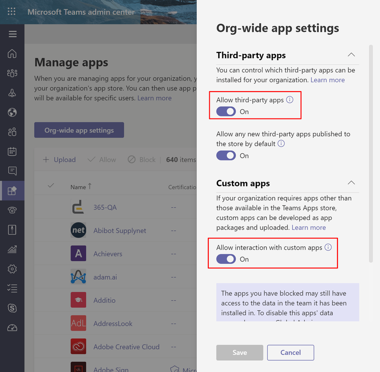
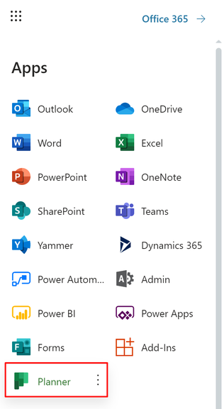
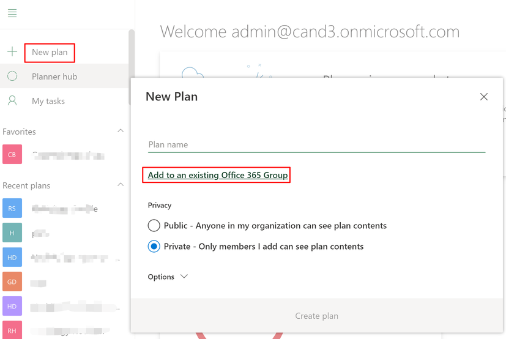
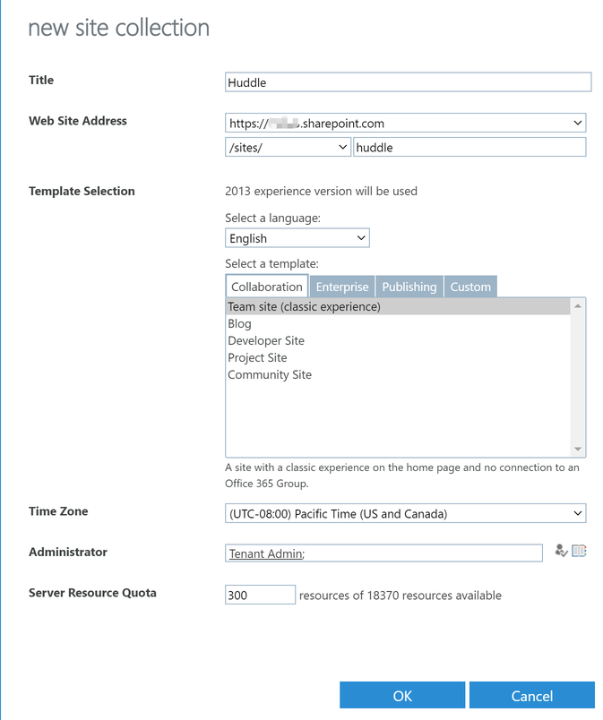
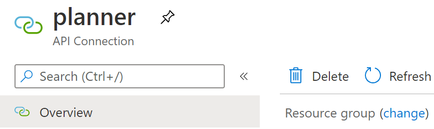
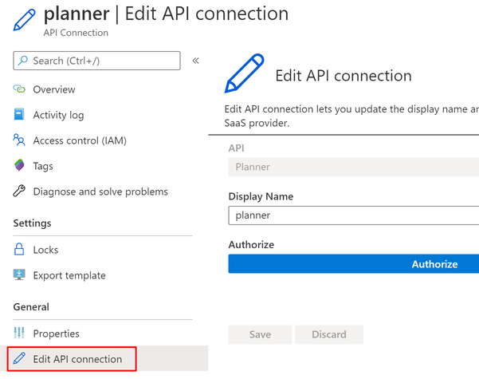
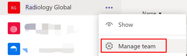
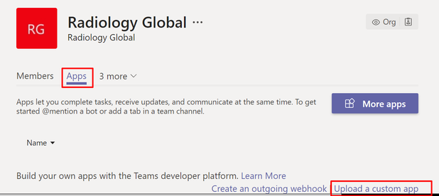
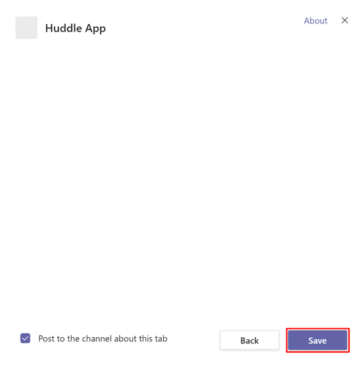
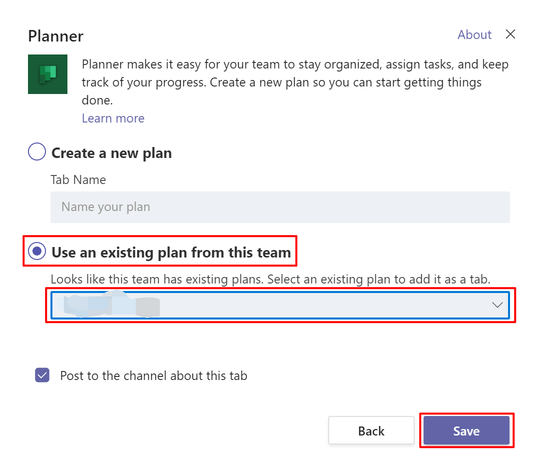

# Huddle

**Table of content**

[Foreword](#foreword)

[Enable and Create Microsoft Teams](#enable-and-create-microsoft-teams)

* [Enable Microsoft Teams feature](#enable-microsoft-teams-feature)
* [Create Teams](#create-teams)
* [Update Each Team](#update-each-team)

[Import and publish LUIS App](#import-and-publish-luis-app)

* [Import LUIS App](#import-luis-app)
* [Set application as public](#set-application-as-public)
* [Train and Publish the App](#train-and-publish-the-app)

[Create SharePoint Site and Lists](#create-sharepoint-site-and-lists)

* [Create a site collection](#create-a-site-collection)
* [Provision Lists](#provision-lists)
* [Add preset data](#add-preset-data)

[Generate a self-signed certificate](#generate-a-self-signed-certificate)

* [Generate certificate with PowerShell](#generate-certificate-with-powershell)
* [Get keyCredential](#get-keycredential)
* [Export the Certificate and Convert to Base64 String](#export-the-certificate-and-convert-to-base64-string)

[Create App Registrations in AAD](#create-app-registrations-in-aad)

* [Get Tenant Id](#get-tenant-id)
* [Create App Registration for the Bot Web App](#create-app-registration-for-the-bot-web-app)
* [Create App Registration for the Metric Web App](#create-app-registration-for-the-metric-web-app)
* [Create App Registration for the MS Graph Connector](#create-app-registration-for-the-ms-graph-connector)
* [Add keyCredential to App Registrations](#add-keycredential-to-app-registrations)

[Register Microsoft App for Bot Registration](#register-microsoft-app-for-bot-registration)

[Deploy Azure Components with ARM Template](#deploy-azure-components-with-arm-template)

* [GitHub Authorize](#github-authorize)
* [Deploy Azure Components](#deploy-azure-components)
* [Handle Errors](#handle-errors)

[Follow-up Steps](#follow-up-steps)

* [Add Reply URL and Admin Consent Bot Web App](#add-reply-url-and-admin-consent-bot-web-app)
* [Add Reply URL and Admin Consent Metric Web App](#add-reply-url-and-admin-consent-metric-web-app)
* [Add Reply URL to MS Graph Connector App Registration](#add-reply-url-to-ms-graph-connector-app-registration)
* [Customize and Configure the Bot](#customize-and-configure-the-bot)
* [Authorize Planner API Connection](#authorize-planner-api-connection)
* [Authorize Teams API Connection](#authorize-teams-api-connection)
* [Authorize Microsoft Graph API Connection](#authorize-microsoft-graph-api-connection)

[Configure Teams App](#configure-teams-app)

* [Start Conversation with The Bot](#start-conversation-with-the-bot)
* [Create Teams App Package and Side-load It](#create-teams-app-package-and-side-load-it)
* [Add Metric Input Tab](#add-metric-input-tab)
* [Add Idea Board Tab](#add-idea-board-tab)

## Foreword

This document will guide you to deploy the solution to your environment.

First, an Azure AAD is required to register the app registrations. In this document, the Azure AAD will be called "Huddle AAD", and an account in Huddle AAD will be called Huddle work account.

* All app registrations should be created in the Huddle AAD. 
* Bot/Luis/Microsoft App should be registered with a Huddle work account.


* SharePoint lists should be created on SharePoint associating with Huddle AAD.

An Azure Subscription is required to deploy the Azure components. We will use the [ARM Template](azuredeploy.json) to deploy these Azure components automatically. 

Please download files in `/Files` folder to your computer.

## Enable and Create Microsoft Teams

### Enable Microsoft Teams feature

Please follow [Enable Microsoft Teams features in your Office 365 organization](https://docs.microsoft.com/en-us/microsoftteams/enable-features-office-365).

Make sure the following options are turned on:

* Allow external apps in Microsoft Teams

* Allow sideloading of external apps

  

### Create Teams

In this section, we will connect to Microsoft Teams in PowerShell with a Huddle work account, and execute some PowerShell scripts to create teams from an Excel file.

> Note: after you finish this section, teams will be created right away. But their owners and members will take up to an hour to show in Teams. Refer to [Add-TeamUser](https://docs.microsoft.com/en-us/powershell/module/teams/add-teamuser?view=teams-ps) for more details.

1. First, let open and edit `/Files/Teams.xlsx`. Input the teams and related information.

   > Note: 
   >
   > * AccessType:
   >   * Private: Private teams can only be joined if the team owner adds you to them. They also won't show up in your teams gallery.
   >   * Public: public teams are visible to everyone from the teams gallery and you can join them without getting approval from the team owner.
   > * Owners and Members:
   >   * Please use UPN (User Principle Name) instead of email.
   >   * Use ";" to separate multi-users. 
   >   * The Huddle work account used to connect to Microsoft Teams will be added as the owner of each team automatically, no matter it is in the owners column or not.

2. Run PowerShell as Administrator, and execute the commands below to install required modules:

   ~~~powershell
   Install-Module -Name MicrosoftTeams
   Install-Module -Name ImportExcel
   ~~~

3. Navigate to the `/Files` folder in PowerShell

   ~~~powershell
   cd <Path to Files folder> # For example: cd "c:\Users\Admin\Desktop\Huddle\Files\"
   ~~~

4. Connect to Microsoft Teams with a Huddle work account.

   ```
   $connection = Connect-MicrosoftTeams
   ```

5. Execute the commands below which reads data from the Excel file and create teams:

   ```powershell
   function Coalesce($a, $b) { 
       if ($a -ne $null) { $a } else { $b } 
   }

   $index = 0;
   $splitOption = [System.StringSplitOptions]::RemoveEmptyEntries
   $teams = Import-Excel teams.xlsx -DataOnly
   $count = Coalesce $teams.Count 1

   Foreach($team in $teams) {
       $accessType = Coalesce $team.AccessType "Private"
       $owners = (Coalesce $team.Owners "").Split(';', $splitOption)
       $members = (Coalesce $team.Members "").Split(';', $splitOption)

       Write-Progress -Activity "Creating Teams" -Status 'Progress->' -PercentComplete ($index * 100 / $count) -CurrentOperation ("Creating Team " + $team.Name)
       $t = New-Team -AccessType $accessType -DisplayName $team.Name

       Write-Progress -Activity "Creating Teams" -Status 'Progress->' -PercentComplete (($index + 0.5) * 100 / $count) -CurrentOperation ("Adding owners and members to " + $team.Name)
       Foreach ($owner in $owners) {
           if ($owner -eq $connection.Account.Id) { continue }
           Try {
               Add-TeamUser -GroupId $t.GroupId -User $owner -Role Owner
           }
           Catch {
               $ErrorMessage = $_.Exception.Message
               Write-Host "Could not add $owner to $team.Name as owner: $ErrorMessage"
           }
       }

       Foreach ($member in $members) {
           if ($member -eq $connection.Account.Id) { continue }
           Try {
               Add-TeamUser -GroupId $t.GroupId -User $member -Role Member
           }
           Catch {
               $ErrorMessage = $_.Exception.Message
               Write-Host "Could not add $member to $team.Name as member: $ErrorMessage"
           }
       }
       $index++
   }
   ```

### Update Each Team

For each team you created, please active the default planer and create 4 buckets:

1. Open <https://www.office.com>, sign in.

   

   Click **Planner**.

   Find the planner which has the same name as the team, then click it.

   


2. Create the following buckets:
   * New Idea
   * In Progress
   * Completed
   * Shareable

## Import and publish LUIS App

### Import LUIS App

1. Open [https://www.luis.ai/](https://www.luis.ai/), then sign in with a Huddle work account.

2. Finish or skip the welcome page. Then go to the applications page:

   

3. Click **Import New App**.

   

   * Click **Choose File**, and select `/Files/LUISApp.json`.
   * Click **Done**. 

4. Click **SETTINGS**.

   

   Copy aside the **Application ID**. It will be used as the value of the **Luis App Id** parameter of the ARM Template.

### Set application as public

1. On the settings page, check **Set application as public**. 

   

2. Click **Save changes**.

   > Note: you might need to input some **description** to enable the **Save changes** button.

### Train and Publish the App

1. Click **Train**.

   

2. Click **Publish**.

   

   Click **Publish to production slot**.


## Create SharePoint Site and Lists

### Create a site collection

1. Open a web browser and go to SharePoint Administration Center.

   `https://<YourTenant>-admin.sharepoint.com/_layouts/15/online/SiteCollections.aspx`

2. Click **New** -> **Private Site Collection**.

    

3. Fill in the form:

   

   * In the **Title** field, enter site title. 
   * In the **Web Site Address** field, enter hospital site URL.
   * **Select a language**: English
   * In the **Template Selection** section, select **Team Site** as **site template.**
   * Choose a  **Time Zone**.
   * **Administrator** should be the alias of the individual you want to have full administrator rights on this site. 
   * Leave **Server Resource Quota** at 300. (This value can be adjusted later if needed)

4. Click **OK**.

5. Copy aside the URL of the site collection. It will be used as the value of **Base SP Site Url** parameter of the ARM Template.

###  Provision Lists

1. Install SharePointPnPPowerShellOnline module, if you have not installed it. 

   Please follow: <https://msdn.microsoft.com/en-us/pnp_powershell/pnp-powershell-overview#installation>

2. Open Power Shell, then execute the command below to connect to the site you just created:

   ```powershell
   Connect-PnPOnline -Url https://<Tenant>.sharepoint.com/sites/<Site> -Credentials (Get-Credential)
   ```

   > Note: Please replace `<Tenant>` and `<Site>`.

3. Login in with an admin account.

   

4. Navigate to `/Files` folder in PowerShell, then execute the following command:

   ```powershell
   Apply-PnPProvisioningTemplate -Path PnPProvisioningTemplate.xml
   ```

### Add preset data

Add some categories to the Categories list, for example:

* Safety/Quality
* Access
* Experience
* Finance
* People

## Generate a self-signed certificate

### Generate certificate with PowerShell

Run PowerShell **as administrator**, then execute the commands below:

~~~powershell
$cert = New-SelfSignedCertificate -Type Custom -KeyExportPolicy Exportable -KeySpec Signature -Subject "CN=Huddle App-only Cert" -NotAfter (Get-Date).AddYears(20) -CertStoreLocation "cert:\CurrentUser\My" -KeyLength 2048
~~~

> Note: please keep the PowerShell window open until you finish the steps below.

### Get keyCredential

Execute the commands below to get keyCredential:

> Note: Feel free to change the file path at the end of the command.

~~~powershell
$keyCredential = @{}
$keyCredential.customKeyIdentifier = [System.Convert]::ToBase64String($cert.GetCertHash())
$keyCredential.keyId = [System.Guid]::NewGuid().ToString()
$keyCredential.type = "AsymmetricX509Cert"
$keyCredential.usage = "Verify"
$keyCredential.value = [System.Convert]::ToBase64String($cert.GetRawCertData())
$keyCredential | ConvertTo-Json > c:\keyCredential.txt
~~~

The keyCredential is in the generated file, and will be used to create App Registrations in AAD.


### Export the Certificate and Convert to Base64 String

The following commands will export the certificate and convert it to a base64 string.

~~~powershell
$password = Read-Host -Prompt "Enter password" -AsSecureString
$bytes = $cert.Export([System.Security.Cryptography.X509Certificates.X509ContentType]::Pfx, $password)
[System.Convert]::ToBase64String($bytes) | Out-File 'c:\cert-base64.txt'
~~~

You will be prompted to input a password to protect the certificate. Please copy aside the password. It will be used as the value of the **Certificate Pfx Password** parameter of the ARM Template

The base64 string of the certificate is in the generated text file, and will be used as the value of the **Certificate Pfx Base64** parameter of the ARM Template.


## Create App Registrations in AAD 

### Get Tenant Id

Open the AAD in Azure Portal, then get the **Directory ID**.


The **Directory ID** will be used as the value of  **Tenant Id** parameter of the ARM Template.

### Create App Registration for the Bot Web App

1. Create a new App Registration:

   * Name: Huddle Bot Web App

   * Application Type: Web app/API

   * Sign-on URL: https://huddle/bot-web-app

   * Permissions:

      | API                                      | Permission Type | Permissions                              |
      | ---------------------------------------- | --------------- | ---------------------------------------- |
      | Office 365 SharePoint Online<br />(Microsoft.SharePoint) | Application     | Read and write items and lists in all site collections |
      | Microsoft  Graph                         | Delegated       | Read and write all groups<br />Read all users' full profiles |

2. Copy aside the **Application Id**. It will be used as the values of **Bot Client Id** parameter of the ARM Template.

3. Create a new Key and copy aside its value. The key value will be used as the value of **Bot Client Secret** parameter of the ARM Template.

### Create App Registration for the Metric Web App

1. Create a new App Registration:

   * Name: Huddle Metric Web App

   * Application Type: Web app/API

   * Sign-on URL: https://huddle/metric-web-app

   * Permissions:

      | API                                      | Permission Type | Permissions                              |
      | ---------------------------------------- | --------------- | ---------------------------------------- |
      | Office 365 SharePoint Online<br />(Microsoft.SharePoint) | Application     | Read and write items and lists in all site  collections |
      | Windows Azure Active Directory<br />(Microsoft.Azure.ActiveDirectory) | Delegated       | Read directory data<br />Sign in and read user profile |
      | Microsoft Graph                          | Delegated       | Read and write all groups<br/>Read all groups<br />Read and write all users' full profiles |

2. Copy aside the **Application Id**. It will be used as the values of **Metric Client Id** parameter of the ARM Template.

3. Create a new Key and copy aside its value. The key value will be used as the value of **Metric Client Secret** parameter of the ARM Template.

### Create App Registration for the MS Graph Connector

1. Create a new App Registration:

   * Name: Huddle MS Graph Connector

   * Application Type: Web app/API

   * Sign-on URL: https://huddle/ms-graph-connector

   * Permissions:

      | API             | Permission Type | Permissions                              |
      | --------------- | --------------- | ---------------------------------------- |
      | Microsoft Graph | Delegated       | Read and write all groups<br />Read all users' full profiles |

2. Copy aside the **Application Id**. It will be used as the values of **Graph Client Id** parameter of the ARM Template.

3. Create a new Key and copy aside its value. The key value will be used as the value of **Graph Client Secret** parameter of the ARM Template.

### Add keyCredential to App Registrations 

Follow the steps below to add keyCredential to App Registrations of the Bot Web App and Metric Web App

1. Open an App Registration

   

2. Click **Manifest**

   

3. Insert the keyCredential into the square brackets of the **keyCredentials** node.
4. Click **Save**.

## Register Microsoft App for Bot Registration

1. Open [https://apps.dev.microsoft.com/portal/register-app](https://apps.dev.microsoft.com/portal/register-app) in a browser, then sign in with the Huddle work account.

    

2. Fill the field **Application Name**, then click **Create**.

    

3. Copy the **Application Id**. It will be used as **Microsoft App Id** parameter of the ARM Template.

    

4. Click **Generate New Password** in **Application Secrets** section.

    

5. Copy the key then click **OK**. The key will be used as **Microsoft App Password** parameter of the ARM Template.

    

6. Scroll down to the end. Click **Save**.


## Deploy Azure Components with ARM Template

### GitHub Authorize

1. Generate Token

   - Open [https://github.com/settings/tokens](https://github.com/settings/tokens) in your web browser.

   - Sign into your GitHub account where you forked this repository.

   - Click **Generate Token**.

   - Enter a value in the **Token description** text box.

   - Select the following s (your selections should match the screenshot below):

     - repo (all) -> repo:status, repo_deployment, public_repo
     - admin:repo_hook -> read:repo_hook

     

   - Click **Generate token**.

   - Copy the token.

2. Add the GitHub Token to Azure in the Azure Resource Explorer

   - Open [https://resources.azure.com/providers/Microsoft.Web/sourcecontrols/GitHub](https://resources.azure.com/providers/Microsoft.Web/sourcecontrols/GitHub) in your web browser.

   - Log in with your Azure account.

   - Selected the correct Azure subscription.

   - Select **Read/Write** mode.

   - Click **Edit**.

   - Paste the token into the **token parameter**.

     

   - Click **PUT**.

### Deploy Azure Components

1. Fork this repository to your GitHub account.

2. Click the Deploy to Azure Button:

   [](https://portal.azure.com/#create/Microsoft.Template/uri/https%3A%2F%2Fraw.githubusercontent.com%2FTylerLu%2FHuddle%2Fmaster%2Fazuredeploy.json)

3. Fill in the values on the deployment page:

   

   You have collected most of the values in previous steps. For the rest parameters:

   * **Bot Name**: the name of the bot, will be used as Display Name of Bot Registration.
   * **Global Team**: the name of the global team.
   * **Source Code Repository**:  use the URL of the repository you just created -`https://github.com/<YourAccount>/Huddle`
   * **Source Code Branch**: master
   * **Source code Manual Integration**: false
   * Check **I agree to the terms and conditions stated above**.

    > **Tips:**
    >
    > You can click **Edit Parameters** on top of the template after filled all parameters.
    >
    > 
    >
    > Then click **Download** to save parameters on your local computer in case of deployment failure.
    >
    > 

4. Click **Purchase**.

### Handle Errors

If the deployment started, but failed as below - one or two errors of sourcecontrols resources:


Please **Redeploy** with the same parameters and to the same resource group.

# Follow-up Steps

### Add Reply URL and Admin Consent Bot Web App

1. Get the URL of the Bot Web app, and change the schema to http**s**, we will get a base URL.

    

    For example: `https://huddle-bot.azurewebsites.net`

2. Append `/` to the base URL, we will get the replay URL. 

   For example: `https://huddle-bot.azurewebsites.net/`

   Add it the Bot App Registration.

   

3. Append `/admin/consent` to the base URL, we will get the admin consent URL.

   For example: `https://huddle-bot.azurewebsites.net/admin/consent`

   Open it in a browser, sign in with a Huddle admin account.

   

   Click **Accept**.

### Add Reply URL and Admin Consent Metric Web App

Follow the similar steps in the previous chapter to add the reply URL and admin consent. 

### Add Reply URL to MS Graph Connector App Registration

1. Get the redirect URL from the Microsoft graph connector. 

   

   * Click the connector, then click **Edit**:

   

   * Click **Security**:

     

     Copy the **Redirect URL** at the bottom of the page.

2. Add it to reply URLs of the MS Graph Connector App Registration.

### Customize and Configure the Bot

1. Navigate to the Bot Channels Registration you created.

   

2. Upload an icon:

   * Click **Settings**.

      

   * Upload `/Files/HuddleBotIcon.png` as the **Icon**. 

   * Click **Save**.


3. Add Microsoft Teams Channel:

   * Click **Channels**.

     

   * Click the **Microsoft Teams Icon** under **Add a channel** section.

     

     Click **Done**.

   * Right-click the new added **Microsoft Teams** channel.

     

   * Click **Copy link address**, and paste the URL to someplace. It will be used to add the Bot to Microsoft Teams later.

4. Verify the Bot:

   - Click **Test in Web Chat**:

     

   - Input `list ideas`, then send.

     

   - If you get responses like above, the Bot is deployed successfully.

     >Note: If the message could not be sent, please click **retry **for a few times**.**
     >
     >

### Authorize Planner API Connection

1. Navigate to the resource group.

   

2. Click the **planner** API Connection.

   

3. Click **This connection is not authenticated**.

   


4. Click **Authorize**.

   Pick up or input the Huddle work account. The user account should be in every team.

   Sign in the account.

5. Click **Save** at the bottom.

### Authorize Teams API Connection

Follow the similar steps in the previous chapter to authorize the **teams** API Connection.


### Authorize Microsoft Graph API Connection

Follow the similar steps in the previous chapter to authorize the **microsoft-graph** API. 


## Configure Teams App

### Start Conversation with The Bot

Follow the step below to start 1:1 conversation with the Bot in Microsoft Teams

1. Find the URL of Microsoft Teams Channel of the Bot, 

   

   Then open it in your browser:

   

2. Click **Open Microsoft Teams**.

Another way to start 1:1 talk is using the **MicrosoftAppId** of the Bot:


### Create Teams App Package and Side-load It

1. Open `/Files/TeamsAppPackage/manifest.json` with a text editor.

2. Replace the following 2 placeholders with the corresponding values you got in previous guides:

   * `<MicrosoftAppId>`: the Application Id of the Microsoft App registered for Bot Registration.

     

   * `<MetricWebAppDomain>`: the domain of the Metric Web App

     

3. Save the changes.

4. Zip the files in `/Files/TeamsAppPackage` folder.

   

   Name it HuddleTeamsApp.zip.

5. Right-click a team in Microsoft Teams, then click Manage team.

   

6. Click the **Apps** tab.

   

7. Then click **Upload a custom app**.
8. Select the *HuddleTeamsApp.zip*.

### Add Metric Input Tab

1. Click a team.

           

2. Click **+**

   

3. Click **Huddle App**.

   

4. Click **Accept**.

   

5. Click **Save**.

### Add Idea Board Tab

1. Click a team.

           

2. Click **+**

   

3. Click **Planner**.

4. Sign in with the Huddle work account.

   

   Choose **Use an existing plan**, then select the plan which has the same name as the team.

5. Click **Save**.

   

6. Click the dropdown icon, then click **Rename**. 

   

   Input: IdeaBoard

7. Click **Save**. 


**Copyright (c) 2018 Microsoft. All rights reserved.**